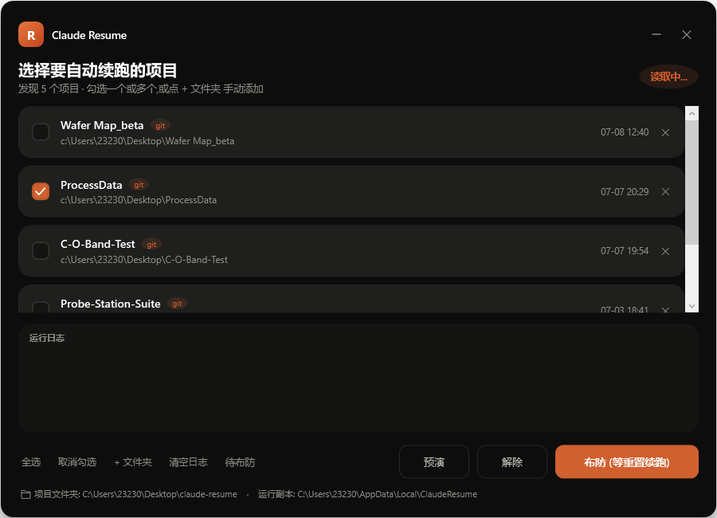

# Claude Resume

> Pick your Claude Code projects, arm it, and it auto-continues them the moment your usage window resets — fully unattended, in the background.

A polished Windows tool for people who hit the Claude Code **5-hour usage limit** mid-task across several projects. Tick the projects you want, press **布防 (Arm)**, and close it. When the limit resets, a background task confirms the account is usable and runs `claude --continue` in each selected project so you come back to finished work.



## Requirements

- Windows 10 / 11
- [Node.js](https://nodejs.org) (LTS) — also runs the optional Feishu two-way agent
- Claude Code CLI — `npm i -g @anthropic-ai/claude-code` (shares login/sessions with the VS Code extension)

## Install

```powershell
powershell -ExecutionPolicy Bypass -File src\install.ps1
```

This copies the program to `%LOCALAPPDATA%\ClaudeResume`, creates the Desktop shortcut **「Claude续跑」**, and registers the Scheduled Task `ClaudeResumeChecker` (runs every 2 minutes). It starts **disarmed**.

## Use

1. Double-click **「Claude续跑」** on the Desktop — the picker opens (no console window).
2. Tick one or more projects (auto-discovered from your Claude Code history; use **+ 文件夹** to add any folder).
3. Press **布防 (Arm)**. Close the window if you like. You can arm **before or after** hitting the limit — if you still have quota it simply stays armed and watches until the limit hits, then resumes the moment it lifts.
4. When the 5-hour window resets, the background checker confirms readiness and continues each project. Watch progress in the log, or in `logs\run-*.log`.

- **预演 (Preview)** — dry-run: shows what *would* happen (which projects, the probe cadence) without running anything.
- **解除 (Disarm)** — global kill switch; stops all auto-resume instantly.
- **导出日志 (Export log)** — merges every `run-*.log` (+ GUI error log) into one shareable UTF-8 file for troubleshooting.
- **Quota chip (top-right)** — shows your live usage as a percentage (`5h 62%`, or `7d 53%` when the 5h window is fresh), switching to a precise countdown (`5h 限流 · 1h 04m`) once limited. It **probes on open** and **re-probes when you click it** (it doubles as the ⟳ refresh button).
- **间隔 (Interval chip)** — how often the checker auto-probes your quota while armed; click to cycle 5m / 15m / 30m. Once limited it tightens to ~4 min automatically (rejected probes are free).
- The GUI is **single-instance** (opening it again focuses the existing window) and shows its own coral icon in the taskbar.

> **About the numbers:** there is **no estimation** — every reset time / percentage is read *live* from Claude. The probe runs `claude -p` as `stream-json`; Claude emits a `rate_limit_event` carrying the server's `resetsAt` and `utilization` (the same values the `/usage` screen shows). Firing is driven by the same live probe, so the tool resumes at the real reset regardless of what's on screen.

## Feishu (飞书) integration — optional (one bot does everything)

Configure a Feishu **自建应用** and a single bot handles **both** notifications and two-way commands, in the same chat.

1. **Set up the app** (developer console): enable the **bot**; grant scope `im:message` (send + receive); under 事件与回调 set 订阅方式 to **长连接** and subscribe the **接收消息 `im.message.receive_v1`** event (a "v2.0" badge on it is fine — the event name still ends `_v1`); then **发布版本**.
2. Put `feishuAppId` + `feishuAppSecret` into `%LOCALAPPDATA%\ClaudeResume\config.json` and re-run `install.ps1`. A background agent (`feishu-agent.js`, Node long-connection — **no public IP needed**) starts at logon.
3. **DM the bot once** (say `帮助`). That registers the chat, so from then on the checker's notifications (limited / resume started / per-project ✅❌ / all done) come from this same bot.

How it talks: by default you're in **chat mode** (just chatting with Claude, no project touched). Send **项目** to list projects, **进入 2** (or a project's name) to start operating on one — then every message runs `claude --continue` there — and **退出** to go back to chat. Also: **`<项目名> <指令>`** for a one-off without switching, plus **状态** / **停止** / **帮助**. A project run continues the **same** conversation your VS Code session shows (reopen the session to see it — the panel doesn't live-refresh external appends).

> Prefer not to set up an app? Set `feishuWebhook` (a group **custom-bot** webhook, `feishuSecret` if 签名校验 is on) for **one-way notifications only**.

## Safety

This runs Claude **unattended** on your real repos, so it is deliberately guarded:

- **Full-autonomy mode** (`--dangerously-skip-permissions`) is paired with a **git dirty-guard**: before resuming a repo with uncommitted changes, it auto-`git stash`es so anything the run does is recoverable.
- **Live probe** before every real resume — a `claude -p` call must succeed first, which is the only thing that also proves the separate **weekly** cap is clear (a passed 5-hour reset is necessary but not sufficient). Success is judged from the probe's structured `stream-json` result, **never** from the process exit code (which PowerShell 5.1 reads back as `$null`).
- **One-shot**: after a successful run it disarms itself, so it never loops every 5 hours.
- **Per-project timeout** + **process-tree kill**, **fail-closed** on any ambiguous read (assumes "still limited"), and full logging.

## Where things live

- **Project / source / docs:** `C:\Users\23230\Desktop\claude-resume`
- **Runtime copy:** `%LOCALAPPDATA%\ClaudeResume`

Edit the source here, then re-run `src\install.ps1` to redeploy.

See [docs/ARCHITECTURE.md](docs/ARCHITECTURE.md) for how it works internally.
