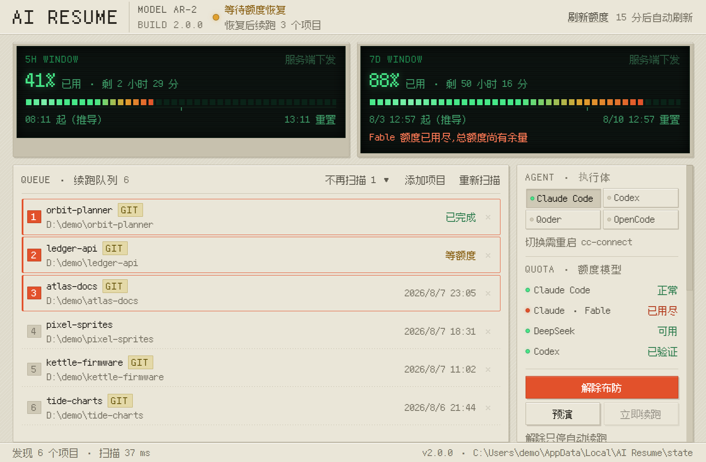

# AI Resume

**English** | [简体中文](README.zh-CN.md)

[](#requirements)
[](https://dotnet.microsoft.com/)
[](LICENSE)

> A local Windows control plane for AI coding agents. It queues projects when Claude Code hits a usage limit, resumes them after reset, discovers real projects, and sends one notification when a full agent task finishes.

AI Resume has no cloud backend of its own. The GUI, queue, state, credentials and hooks stay on your machine; agent traffic goes through the providers you configure.



## Why it exists

AI Resume deliberately owns four responsibilities:

| Capability | What it guarantees |
|---|---|
| **Post-limit resume** | Holds a project queue while Claude Code is limited, then resumes projects in order after the reset. |
| **Project discovery** | Builds a persisted index from agent history and Git roots instead of maintaining a hard-coded project list. |
| **Completion notifications** | Sends one Feishu message when Claude Code, Codex, Cline, Qoder or OpenCode finishes a whole task. |
| **Windows control panel** | Shows quota evidence, queue state, provider health, agent selection, credentials and notification delivery. |

Chat platforms, sessions, agent turns and scheduled chat tasks belong to [cc-connect](https://github.com/chenhg5/cc-connect). AI Resume integrates with that upstream instead of reimplementing it.

## Quick start

### Requirements

- Windows 10 or 11
- [.NET 10 SDK](https://dotnet.microsoft.com/download)
- [Claude Code CLI](https://claude.com/claude-code): `npm i -g @anthropic-ai/claude-code`
- Optional for phone chat: `npm i -g cc-connect@1.4.1`
- Optional agents/providers: Codex CLI, DeepSeek API credentials

### Build and install

```powershell
git clone https://github.com/AquariusCZ/claude-resume.git
cd claude-resume
dotnet build csharp\AiResume.sln -c Release
csharp\src\AiResume.Worker\bin\Release\net10.0-windows\AiResume.Worker.exe install
```

Open **AI Resume** from the Desktop or Start menu. Re-run `install` after rebuilding; the installed copy under `%LOCALAPPDATA%\AI Resume\` is the runtime, not `bin\Release`.

The installer accepts only an empty directory, a preserved-state directory, an exact prior payload, an installed AI Resume root, or an exact preserved-root marker left by a prior uninstall; uninstall still requires both the active ownership marker and payload manifest. It stages and backs up the runtime, freezes per-file SHA-256 digests, removes retired manifest files, replaces GUI/Worker/Hook together, verifies the committed bytes against the staging snapshot, and waits for the exact new Worker PID to answer the current Named Pipe protocol before changing shortcuts or hooks. The Worker is launched without inheriting redirected installer pipes, so scripted installs can observe process exit promptly. Self-uninstall runs through a manifest-bounded temporary Worker that transactionally moves the installed payload into its private retirement area before reporting success, so an immediate reinstall cannot race old cleanup. Missing or invalid results and helper crashes leave the recovery directory untouched instead of deleting the only retired copy. State and unknown files are preserved; a preserved-root marker permits reinstall without granting delete authority. Incomplete rollback returns non-zero and keeps recovery material.

Uninstall without deleting user settings:

```powershell
& "$env:LOCALAPPDATA\AI Resume\AiResume.Worker.exe" uninstall
```

## Core workflows

### Quota and automatic resume

The main source is Anthropic's OAuth usage endpoint using Claude Code's real request shape. AI Resume reads the existing token but never refreshes or writes it. Modern `session`, `weekly_all` and every `weekly_scoped` limit are supported; Fable and other scoped limits appear separately.

Quota responses are sparse, so absence is not treated as deletion. A recent value is carried only for the same account, scope and unexpired reset generation, then shown as an amber **recent server reading**. Known `0%` is an empty track, known `100%` is full, and reset-only data uses an indeterminate scan rather than inventing a percentage.

Select projects, press **Arm**, and close the window. The Worker keeps the queue and resumes projects only after the reset evidence is valid.

Detailed protocol: [Claude quota acquisition and validation](docs/CLAUDE-QUOTA-ACQUISITION.md).

### Provider health and third-party balance

Codex combines provider authentication, balance and minimal-inference evidence. Window-open and periodic checks run `codex doctor --json`, authenticated `{base_url}/models`, and a zero-token `/v1/usage` request for eligible third-party providers. Only the user's **Refresh quota** action adds one `{base_url}/responses` request with `max_output_tokens=1`. All Codex paths resolve the same home (`AI_RESUME_CODEX_HOME`, then `CODEX_HOME`, then `%USERPROFILE%\.codex`) and reproduce provider query parameters and custom headers.

For a Sub2API-style third-party OpenAI-compatible provider, AI Resume follows the CC Switch-compatible `/v1/usage` precedence: `remaining`, `quota.remaining`, then `balance`. A successful response with no explicit invalid-account signal and a positive balance turns Codex green; zero balance, invalid account, authentication failure, HTTP 402, and HTTP 429 still take precedence. Providers without valid balance evidence require a successful minimal `/responses` probe for green. Green represents current provider/account evidence, not an absolute guarantee for every future request. Official OpenAI/ChatGPT endpoints and ChatGPT OAuth credentials do not use that extra route, so this is not a ChatGPT Plus/Pro subscription balance.

### Phone chat through cc-connect

After cc-connect is configured, use Feishu or WeChat:

| Command | Purpose |
|---|---|
| `/dir <path>` or `/dir <n>` | Switch project/working directory |
| `/mode plan` / `/mode auto-edit` | Select read-only planning or editing behavior |
| `/model switch <name>` | Switch model |
| `/provider switch <name>` | Switch API provider |
| `/new`, `/list`, `/switch <n>` | Manage conversations |
| `/stop` | Stop the active task |
| `/cron`, `/timer` | Manage scheduled chat tasks |

Agent, provider and model are separate:

- **Agent**: local executor and session owner, such as Claude Code or Codex.
- **Provider**: remote endpoint and credential used by that agent.
- **Model**: identifier sent to the provider.

The control panel stages a candidate cc-connect config, validates it with cc-connect's own parser, commits it atomically, requests an authenticated self-restart, and verifies a new process generation. It never reports success from a CLI exit code alone. Provider/model preservation rules and the Codex model catalog are documented in [Architecture](docs/ARCHITECTURE.md#agent-provider-and-model-semantics).

### Completion notifications

| Source | Verified completion boundary |
|---|---|
| Claude Code | `Stop` hook |
| Codex | `notify` callback |
| Cline | `TaskComplete` |
| Qoder | `hooks.Stop` |
| OpenCode | `session.idle` plugin |

Adapters merge with existing user configuration and remove only entries they can prove they own. Internal probes and resume runs set `AI_RESUME_INTERNAL_RUN=1` directly. Generated cc-connect projects set the same value in `projects.agent.options.env`, while the scheduled-task launcher also sets it as a daemon-level fallback, so Feishu-launched agent processes do not notify AI Resume about AI Resume's own work.

The current Codex Desktop/app-server cannot be assumed to hot-reload a later `notify` write. After AI Resume installs or refreshes that entry, restart any Codex Desktop process that was already running; configuration health alone cannot prove that an older process has reloaded it.

Protocol and smoke procedure: [Completion notifications](docs/COMPLETION-NOTIFICATIONS.md).

## Safety model

- **Green means verified.** Provider availability requires a real successful request; installed commands and filled keys are not proof.
- **One Feishu consumer.** Two long-connection consumers randomly split events, so preflight fails closed when another consumer is detected.
- **No credential files in Git.** Feishu credentials are stored outside the repository with current-user Windows DPAPI.
- **No PID-only termination.** Parent identity, start time and command signature must match before a process can be reclaimed.
- **No client-side total timeout for agent work.** Silence is telemetry, not a failure verdict.
- **Cancellation is terminal.** A cancelled run is not replayed through another provider.

## Architecture

```text
Feishu / WeChat
       |
       v
  cc-connect ---------> Claude Code / Codex / other agents
       |                            |
       |                            v
       +---------------------- AiResume.Hook
                                    |
                                    v
AiResume.Gui <---- Named Pipe ---- AiResume.Worker
   WPF + WebView2                  queue, quota, discovery,
                                  notifications, supervision
```

State is stored under `%LOCALAPPDATA%\AI Resume\state\`; cc-connect keeps its own config and sessions under `%USERPROFILE%\.cc-connect\`. See [Architecture](docs/ARCHITECTURE.md) and [AI guide](AI_GUIDE.md) for ownership and data-flow details.

## Verification status

Verified on the current Windows installation:

- full isolated xUnit suite and Release build with warnings treated as errors;
- OAuth quota parsing, sparse continuity, scoped/Fable rows and SQLite concurrency;
- shallow/deep Codex verification, third-party balance parsing and per-provider failure isolation;
- equal-height quota panels, indeterminate/reset-only state and reduced-motion behavior;
- all five hook protocols through queue, Worker, lark-cli and Feishu;
- cc-connect candidate parsing, atomic activation and generation-bound restart checks;
- installed GUI/Worker/Hook hashes matching the Release build.

Known limits are stated rather than hidden:

- a real account limit-reset-to-resume cycle has not yet been observed end to end;
- the five notification sources have protocol-level smoke coverage, not five deliberately launched real AI tasks;
- long-running stability has only a short-sample baseline, not a completed 24-hour soak.

## Development

```powershell
dotnet test csharp\AiResume.sln
dotnet build csharp\AiResume.sln -c Release --no-restore -warnaserror
```

The suite uses temporary state, synthetic sessions and injected process/API runners. It does not resume a real session, modify a real project or make paid model calls.

## Documentation

- [Chinese README](README.zh-CN.md)
- [Architecture and configuration](docs/ARCHITECTURE.md)
- [Claude quota acquisition](docs/CLAUDE-QUOTA-ACQUISITION.md)
- [Completion notification protocol](docs/COMPLETION-NOTIFICATIONS.md)
- [Run lifecycle contract](docs/RUN-CONTRACT.md)
- [Upstream research](docs/UPSTREAM-ARCHITECTURE-RESEARCH.md)
- [Engineering lessons](docs/LESSONS.md)
- [AI-oriented repository guide](AI_GUIDE.md)

## License

MIT, see [LICENSE](LICENSE). The interface uses [Ark Pixel Font](https://github.com/TakWolf/ark-pixel-font), distributed under SIL Open Font License 1.1; its license is included at [OFL.txt](csharp/src/AiResume.Gui/wwwroot/fonts/OFL.txt).
