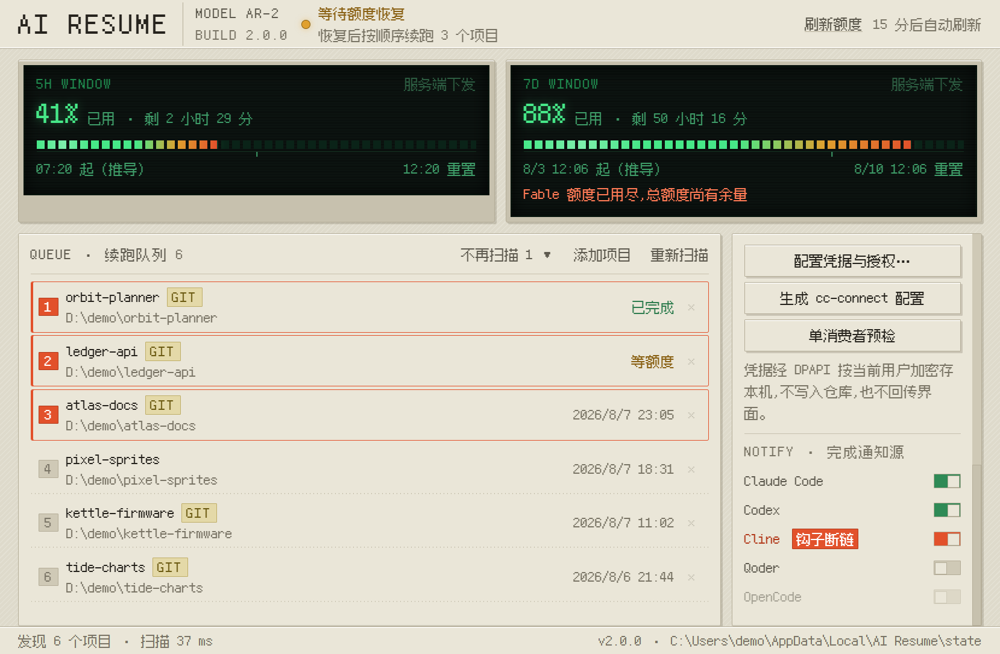

# AI Resume

[English](README.md) · **简体中文**

> Windows 控制面，让 AI 编码 agent 在你睡觉的时候接着干活。Claude Code 撞到额度上限时，AI Resume 把项目排进队列，额度一恢复就按顺序继续。

在手机上用飞书或微信和你的项目对话；长任务跑完时桌面收到通知；额度像仪表盘上的燃料表一样看着往下走。全部跑在本机——不需要服务器，不需要公网 IP，不经过第三方中转。


---

## 它到底做什么

AI Resume 只做**四件事**，其余交给上游：

| | |
|---|---|
| **限额后自动续跑** | 唯一不可替代的部分。Claude Code 报 `LimitReached` 时，AI Resume 拿着项目队列，等窗口重置后按顺序逐个续跑。上游没有这个能力——桥接层只**读取**限额信号，不排队也不续跑。 |
| **项目发现** | 从 agent 会话历史和 Git 根找出你真正的项目，索引落盘（全量扫描 2227 ms → 35 ms）。 |
| **完成通知** | Claude Code / Codex / Cline / Qoder / OpenCode 跑完**整个任务**时给你一条消息。逐个 provider 开关，没启用的绝不写进它的配置。 |
| **控制面** | 额度、续跑队列、agent 选择、凭据和通知源的 Windows 图形界面。 |

消息平台协议、会话持久化、agent 生命周期和定时任务由 **[cc-connect](https://github.com/chenhg5/cc-connect)** 负责，**直接运行而不做包装**。飞书 OpenAPI 走 `lark-cli`。原则是**适配上游而不是改造它**——见 [ADR-0003](docs/adr/0003-cc-connect-direct-and-control-plane.md)。

---

## 环境要求

- Windows 10 / 11
- [.NET 10 SDK](https://dotnet.microsoft.com/download)（构建用）
- [Claude Code CLI](https://claude.com/claude-code) — `npm i -g @anthropic-ai/claude-code`
- `cc-connect` — `npm i -g cc-connect`（只有要用手机聊天时才需要）
- 可选：Codex CLI、DeepSeek API key

---

## 安装

```powershell
dotnet build csharp\AiResume.sln
csharp\src\AiResume.Worker\bin\Debug\net10.0-windows\AiResume.Worker.exe install
```

它把构建产物复制到 `%LOCALAPPDATA%\AI Resume\`，创建桌面与开始菜单快捷方式，把续跑引擎注册为登录自启，并把已启用的完成通知钩子重新指向安装目录。

**为什么必须有这一层**：直接指向 `bin\Debug\` 的入口，只要你清一次构建、换个分支、或者把仓库目录改个名，就全断了——而 Stop 钩子断得**没有任何报错**：界面照样显示"已启用"，只是通知永远不到。安装之后仓库只是源码，跑的是安装目录里的副本。**改完代码要重新 `install` 才生效。**

卸载用 `AiResume.Worker.exe uninstall`——它逐个关闭钩子源，不会删掉你的 `settings.json`。

---

## 用控制面

双击桌面上的 **AI Resume**。

**状态灯**（左上）只回答一个问题：它到底在不在干活？

| 颜色 | 含义 |
|---|---|
| 🟢 绿 | 正常工作 |
| 🟡 琥珀 | 在等（额度还没恢复）。**不是故障。** |
| 🔴 红 | 有问题，需要你动手 |
| ⚪ 灰 | 没布防 |

**额度屏**显示 5 小时和 7 天两个窗口。光柱画的是**已用额度**，不是流逝的时间；窗口里"现在"的位置由另一根细刻度线单独标出。数字来自 Claude 自己的用量接口，**没有任何估算**。

**队列**列出发现的项目。勾上要跑的，按**布防**，然后关窗口。引擎会盯着额度，恢复后按顺序续跑。

**服务状态**显示各 provider 是否可用。绿灯**只能来自一次真实成功的请求**——填了 API key、装了 CLI 都不算。没验证过的一律是灰的。

Codex 那一行还多验一步：能列出模型只证明服务端**认识**这把 key，证明不了它**允许你跑活儿**。所以探测在 `/v1/models` 之后再发一次 `max_tokens=1` 的最小推理请求（个位数 token）。只能列不能推理时它是红的——因为任务一跑就会失败。

---

## 在手机上和项目对话

`cc-connect` 配好并运行之后，在飞书或微信里给机器人发消息：

| 命令 | 作用 |
|---|---|
| `/help` | 命令列表 |
| `/status` | 系统状态（也能拿到自己的 User ID） |
| `/dir <路径>` · `/dir <序号>` · `/dir -` · `/dir reset` | **切换工作目录——手机上就是这样切项目的** |
| `/mode <名字>` | 权限模式：`plan`（近似只读）· `default` · `acceptEdits` · `auto-edit` · `yolo` |
| `/model switch <名字>` | 切换模型 |
| `/provider switch <名字>` | 切换 API 供应商 |
| `/new [名称]` · `/list` · `/switch <序号>` | 新会话 · 列表 · 切换 |
| `/stop` | 停止正在跑的任务 |
| `/compress` | 压缩上下文 |
| `/cron` · `/timer` | 定时任务 |

**只读查询和修改项目的开关是 `/mode`，不是另一个菜单。** `/mode plan` 让 agent 只规划不动文件；`/mode auto-edit` 或 `/mode yolo` 才允许它写。

**Agent 不能在聊天里切。** cc-connect 里一个项目**死绑一个 agent**（`claudecode`、`codex`、`cursor`、`gemini`、`qoder`、`opencode` 等）。要换得在控制面的 **Agent 执行体**里选，重新生成配置，再重启 cc-connect。

**只有你能驱动它。** `allow_from` 和 `admin_from` 把机器人钉死在你在各平台上的用户 ID，别人发的消息直接丢弃。

### 会话历史在哪

- **cc-connect 的会话索引** —— `~/.cc-connect/sessions/<项目名>_<哈希>.json`
- **真正的对话内容** —— 在 agent 那边。用 Claude Code 时是 `~/.claude/projects/<工作目录编码后的名字>/<sessionId>.jsonl`

**闲聊如果不切 `/dir`，就会记在当前工作目录名下**，也就是混进那个项目的会话堆里。想分开，要么 `/dir` 切到一个专门的闲聊目录，要么用 `/new 闲聊` 起一个独立会话。

---

## 完成通知

本地 agent 跑完**整个任务**时给一条消息。准入红线很严：**只接受代表整个 agent 任务结束的边界**。代表单次模型请求结束的回调一律拒绝——否则一个任务能通知你几十次。

已验证的 5 个源：

| Provider | 机制 |
|---|---|
| Claude Code | `Stop` 钩子 |
| Codex | `notify` |
| Cline | `TaskComplete` |
| Qoder | `~/.qoder/settings.json` 的 `hooks.Stop` |
| OpenCode | `session.idle` 插件 |

适配器**合并**进已有的钩子配置而不是覆盖，卸载只移除自己那条。AI Resume 自己的探测和后台续跑带 `AI_RESUME_INTERNAL_RUN=1`，不会自己通知自己。

开关有**三**态，不是两态：关、开、以及**开着但送不到**——钩子还写在配置里，而它指向的程序已经不在了。第三态标红并挂「钩子断链」角标，因为它和"关着"是两回事：关着是你的选择，断链是坏了。



---

## 安全

让 AI 无人值守地动真实仓库，是要设防的：

- **单消费者预检。** 飞书长连接是**集群模式**：同一个应用有两个进程连着时，事件会被**随机**投给其中一个——表现出来就是"机器人时灵时不灵"。控制面会扫本机有没有第二个消费者，发现了就拒绝声明可启动。
- **一切 fail-closed。** 进程探测拿不准时按"还在跑"处理，绝不按"已经没了"。**只凭 PID 永远不杀进程**——父 PID、启动时间、命令签名必须全部对上。
- **绿灯必须有依据。** 可用性只能由一次真实成功的请求断言。
- **凭据不进仓库。** 飞书凭据用 Windows DPAPI 按当前用户加密，存在仓库外，界面也读不回来。
- **AI 运行不设客户端总时限。** 只有结构化的 HTTP 408/504 算 provider 超时；DNS/TCP/TLS 失败和监控异常算本地失败。**静默是指标，不是判据。**
- **用户停止是终态**——不会 fallback 到别的 provider，也不会重放已经产生副作用的运行。

---

## 架构

```
┌── 飞书 / 微信 ──┐
│                 ▼
│           cc-connect  ──►  agent（Claude Code / Codex / …）
│                 │
└─────────────────┼──────────────────────────────────────┐
                  ▼                                      │
    AiResume.Worker ── 续跑引擎、项目索引、               │
            │          通知扫描、进程监督                 │
            │                                            │
    AiResume.Gui ──── WPF + WebView2 控制面 ◄─────────────┘
            │
    AiResume.Hook ─── agent 的钩子调用的那个可执行文件
```

**额度自行获取**，不从桥接层借。主路径是 `GET https://api.anthropic.com/api/oauth/usage`，复用 Claude Code 已有的 OAuth token——**只读、绝不刷新、绝不写回**，因为刷新会和 Claude Code 争用同一个 refresh token。剩余寿命不足 60 秒的 token 视同过期。这条路失败才降级到 `ClaudeCodeProbe` 子进程探测。

延伸阅读：[ARCHITECTURE.md](docs/ARCHITECTURE.md) · [RUN-CONTRACT.md](docs/RUN-CONTRACT.md) · [ADR-0003](docs/adr/0003-cc-connect-direct-and-control-plane.md) · [LESSONS.md](docs/LESSONS.md)

---

## 测试

```powershell
dotnet test csharp\AiResume.sln
```

706 个 xUnit 用例。它们**绝不**对真实项目或真实会话启动 AI 运行，不碰 `~/.claude`、`~/.codex` 和生产状态目录，也不发任何付费 API 请求。探测判定用**录下来的真实响应**做断言，而不是猜的结构——mock 猜错结构的结果是测试全绿、线上静默失效。

---

## 现状

v2 就是上面这套 C# 实现。v1 的 PowerShell + Node 运行时已退役，但仍留在 `src/` 和 `test/` 里备查。

已知缺口，明说：

- **真实限额下的续跑还没有端到端跑通过一次。** 内部链路（布防 → 观测限流 → 等待 → 续跑 → 解除）已在受控响应下走通，真实账户额度复位仍未验证。
- **五个通知源没有一次性全部真实收取过。** 本机只装了其中两个的 CLI。
- **24 小时长稳只有短采样基线**，不足以下结论。

---

## 界面上的每一句话

这一版的主要工作不是加功能，是把界面上的**肯定句**逐条追回到它背后到底验证了什么。

起因是一次外部审计：七个缺陷里没有一个是崩溃，全部是**静默失败**——界面说没事，实际早就坏了。

| 界面当时说 | 实际 |
|---|---|
| 通知源「已启用」 | 钩子指向的程序被删了，通知永远不到 |
| 飞书「已配置」 | 凭据早被开放平台重置，每条消息被丢弃 |
| 「cc-connect 配置已生成」 | 那份 TOML 根本解析不了 |
| 顶部「监视中」 | 续跑引擎已经被杀掉了 |
| Codex「凭据已验证」 | 只能列模型，一跑推理就 403 |
| `install` 退出码 0 | 五个通知源一个都没启用 |

共同点不是"写错了"，而是**判据只看配置、不看世界**。所以现在：

- 通知源要核对那条命令指向的可执行文件是否还在；
- 飞书凭据有一个真发请求换 token 的「验证」按钮；
- cc-connect 配置交给 **cc-connect 自己的解析器**判（校验副本，绝不改动原文件）；
- 状态灯要看引擎进程是否真的在跑，以及最近一次额度探测过去了多久；
- 安装把"用户想开哪几个通知源"**持久化成意图**，再按意图对账——卸载会把现状清空，而现状是当时唯一的依据；
- 核对不出结论时说"未核实"，不说"没问题"。**把未知说成正常，和把故障说成正常一样是在骗人。**

---

## 许可

MIT，见 [LICENSE](LICENSE)。

界面使用 [方舟像素字体](https://github.com/TakWolf/ark-pixel-font)（12px 等宽 zh_cn），依 SIL Open Font License 1.1 分发，许可证原文见 [`fonts/OFL.txt`](csharp/src/AiResume.Gui/wwwroot/fonts/OFL.txt)。
